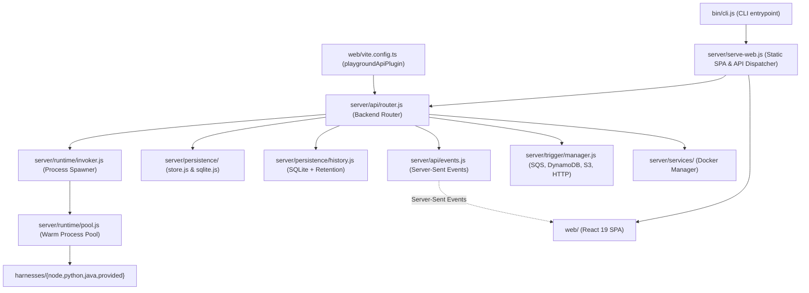

# aws-playground Architecture

This document describes the architectural design, system boundaries, execution model, and data flow of `aws-playground`.

---

## 1. System Overview

`aws-playground` is a local testing environment for AWS Lambda functions. It runs handlers directly on the host machine using lightweight per-language harnesses rather than bulky Docker container emulators (like SAM, LocalStack, or Docker RIE).

---

## 2. Monorepo Organization

The project is structured as an npm workspace with three core packages:

* **`shared/` (`@aws-playground/shared`)**: Canonical TypeScript contracts, types (`FunctionDef`, `InvokeResult`, `TriggerConfig`, `LocalService`, etc.), and runtime schemas shared between backend and frontend.
* **`server/` (`@aws-playground/server`)**: Core execution engine, SQLite persistence, HTTP dispatcher, OTLP trace receiver, trigger pollers, and Docker container lifecycle manager.
* **`web/` (`aws-playground-web`)**: Modern React 19 Single-Page Application (SPA) built with Vite, `@tanstack/react-router`, `@tanstack/react-query`, Radix UI, and TailwindCSS v4.
* **`harnesses/`**: Minimal, dependency-free runners for Node.js, Python, Java, and Custom Runtime (`provided.al2023`).
* **`bin/cli.js`**: CLI binary for starting the server (`aws-playground`), running headless invokes (`aws-playground invoke`), listing functions (`aws-playground list`), and controlling local Docker services (`aws-playground services`).

---

## 3. Web & API Gateway Architecture

### Unified Development & Production Gateway
Both local development (`npm run dev`) and production standalone distribution (`npm start` or `npx`) execute the exact same backend logic:

* In **production**, `server/serve-web.js` creates a native `node:http` server that serves static files from `web/dist` and dispatches all `/api/*` routes to `server/api/router.js`.
* In **development**, `web/vite.config.ts` registers `playgroundApiPlugin()`, a Vite connect middleware that routes `/api/*` requests directly to `server/api/router.js`, providing Hot Module Replacement (HMR) for frontend code alongside instant backend execution.

### Real-Time Observability via Server-Sent Events (SSE)
`server/api/events.js` maintains a persistent SSE stream at `/api/events`. When functions are created/updated, local Docker services start/stop, triggers fire, or handler executions complete:
1. `router.js` emits targeted events (`functions`, `triggers`, `services`, `history`).
2. The web frontend hook `useServerEvents()` in `web/src/lib/events.ts` receives the event and invalidates TanStack Query keys, refreshing the UI in real time without polling overhead.

---

## 4. Execution Engine & Warm Process Pooling

### Isolation & Zero-Docker Runtime
Handlers run inside native child processes on the developer machine:
- **Node.js**: Executes via `node --experimental-strip-types` (native TypeScript execution without compilation) and imports the target export.
- **Python**: Resolves virtual environments (`venv/`, `.venv/`) automatically and executes through `python3`.
- **Java**: Executes fat JARs with an isolated classpath runner.
- **Custom (`provided`)**: Emulates the genuine Lambda Runtime API (`AWS_LAMBDA_RUNTIME_API`) over local HTTP, allowing standard bootstrap binaries and shell scripts to run unchanged.

### Dynamic Warm Pooling (`server/runtime/pool.js`)
To match real AWS Lambda execution environment reuse:
1. When warm pooling is active, a child process stays running and communicates over length-prefixed requests via `stdin` and `stdout`.
2. Module-level variables, database connection pools, and `/tmp` writes persist across invokes.
3. **Automatic Cache Invalidation**: Before acquiring an environment, `pool.js` calculates a cheap non-derived file fingerprint of the project folder. If any project file has been edited, the warm environment is evicted and a fresh cold start is initiated.

---

## 5. Persistence Layer (`server/persistence/`)

Data is persisted in `~/.aws-playground/` (configurable via `AWS_PLAYGROUND_DATA_DIR`):
- **Functions & Metadata**: Stored in `playground.db` via Node 22's native `DatabaseSync` (`node:sqlite`). Operations use ACID transactions, with atomic backup to `functions.json` for disk test contract compatibility.
- **History Logs**: Invocations are recorded in `history` with indexed lookups on `function_id`, `request_id`, and `ts`. Older entries beyond retention limits (50 per function) are trimmed automatically.

---

## 6. Triggers & Local Services

* **SQS Triggers (`server/trigger/sqs.js`)**: Polls local ElasticMQ, translates incoming messages to genuine AWS SQS event shapes, and invokes the function.
* **DynamoDB Streams (`server/trigger/dynamodb.js`)**: Polls local DynamoDB Local streams and delivers batched `Records` arrays.
* **S3 Bucket Triggers (`server/trigger/s3/`)**: Configures MinIO webhooks posting to `http://localhost:9501` to emulate S3 notifications.
* **HTTP API Gateway (`server/trigger/http.js`)**: Listens on `http://localhost:9500/<function-name>/*` and delivers API Gateway v1/v2 payload events, returning the handler's `{ statusCode, headers, body }` as the real HTTP response.
* **Docker Container Management (`server/services/`)**: Starts and stops isolated Docker containers for S3 (MinIO), SQS (ElasticMQ), DynamoDB Local, Redis (ElastiCache), and PostgreSQL (RDS).
